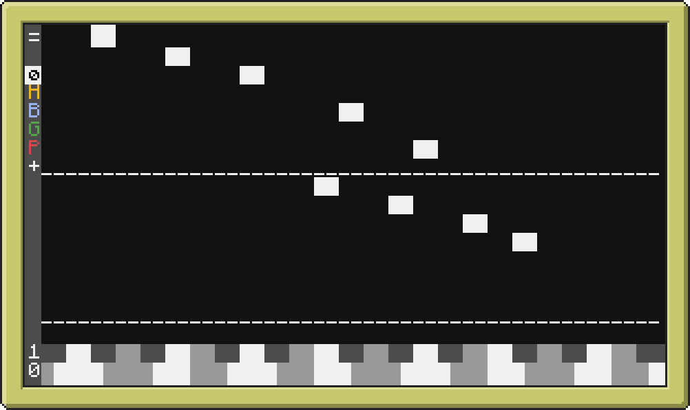
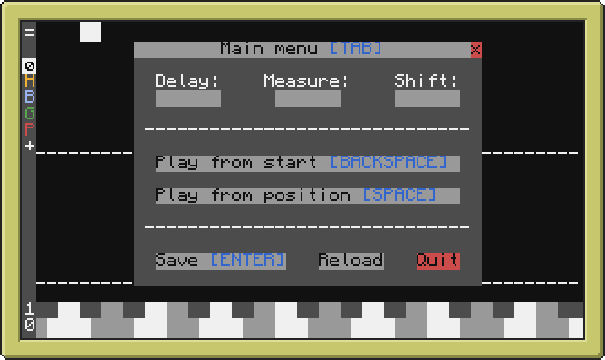
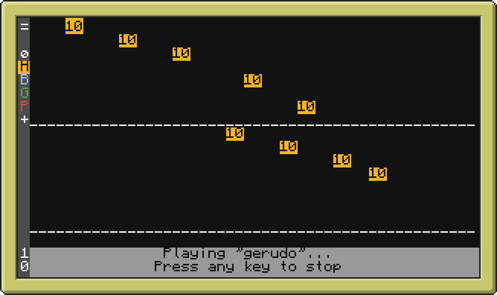
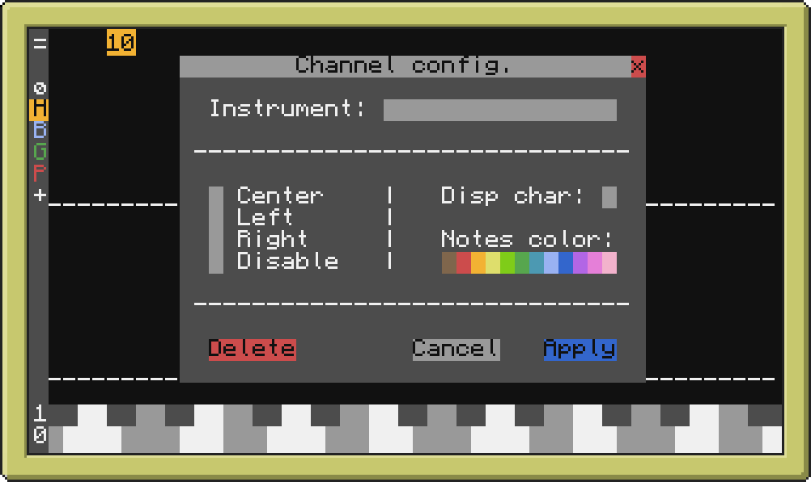

# ComputerCraft Synthesia

**/!\ WARNING /!\ THIS SOFTWARE WORKS BUT IS NOT FINISHED YET!**

This software is intended to run on an Advanced Computer (minimum) with its 51x19 screen (nothing less, nothing more).
Place 3 speakers, top side, left side, and right side (sides are hardcoded).

And just run `score <path to your score file>`, if the file doesn't exist, it will be created.

This software was created for Minecraft 1.12.2, but it should works with later versions, as there is no list of instruments.
You must manually type the name of the instruments, if you type an invalid name, the software will crash during playback!

For performances reasons, I didn't try to make the notes "fall" on the keys, so this software is not very YouTube-able!

<table>
  <tr>
    <td>
      
    </td>
    <td>
      
    </td>
  </tr>
  <tr>
    <td>
      
    </td>
    <td>
      
    </td>
  </tr>
</table>
